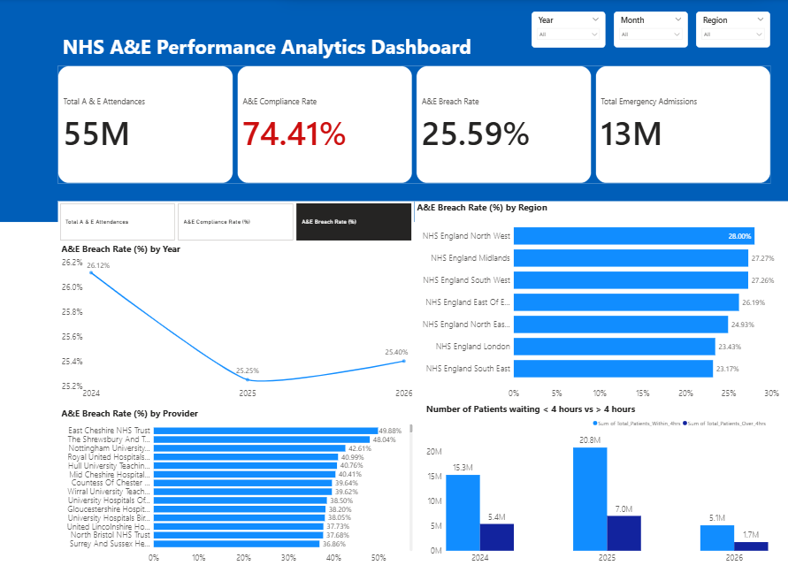

# NHS A&E Performance Analytics Dashboard | Power BI

## Overview

This project analyses NHS Accident & Emergency (A&E) performance using Power BI. The dashboard provides an interactive view of emergency department activity, waiting-time performance, emergency admissions, and regional and provider-level variation across NHS England.

The objective was to transform publicly available NHS data into a reporting solution that supports performance monitoring and highlights areas requiring operational attention.

## Dashboard Preview

---

## Business Problem

NHS organisations must continuously monitor emergency department performance to ensure patients receive timely care and to identify pressures affecting service delivery.

This dashboard was developed to support analysis of:

* Total A&E attendances
* Emergency admissions
* A&E compliance with the four-hour waiting-time standard
* A&E breach rates
* Regional performance variation
* Provider-level performance comparison

---

## Questions Addressed

* How many patients attended A&E services during the reporting period?
* What proportion of patients were seen within four hours?
* What proportion of patients waited longer than four hours?
* Which regions experienced the highest breach rates?
* Which providers demonstrated the highest and lowest performance levels?
* How has A&E performance changed over time?

---

## Dashboard Features

### Key Performance Indicators (KPIs)

* Total A&E Attendances
* Total Emergency Admissions
* A&E Compliance Rate (%)
* A&E Breach Rate (%)

### Interactive Analysis

* Dynamic metric selection using Power BI Field Parameters
* Regional performance comparison
* Provider-level performance benchmarking
* Time-based trend analysis
* Interactive filtering by Year, Month, and Region

---

## Tools & Technologies

* Power BI
* DAX
* Power Query
* Data Modelling

---

## DAX Measures Developed

* Total A&E Attendances
* Total Emergency Admissions
* A&E Compliance Rate (%)
* A&E Breach Rate (%)

These measures were developed to support healthcare KPI reporting and enable dynamic analysis across multiple dimensions.

---

## Key Findings

* More than **55 million A&E attendances** were analysed.
* National **A&E compliance rate was 74.4%** during the reporting period.
* Approximately **one in four patients waited longer than four hours**.
* More than **13 million emergency admissions** were recorded.
* Performance varied across NHS regions and providers, highlighting differences in waiting-time outcomes.

---

## Skills Demonstrated

* Data Cleaning and Transformation
* KPI Development
* DAX Measure Creation
* Data Modelling
* Dashboard Design
* Data Visualisation
* Healthcare Analytics
* Business Intelligence Reporting

---

## Future Enhancements

* Provider drill-through analysis
* Executive summary reporting page
* Seasonal demand analysis
* NHS target gap monitoring
* Forecasting and trend analysis

---

## Data Source

NHS England – A&E Attendances and Emergency Admissions Data

---

